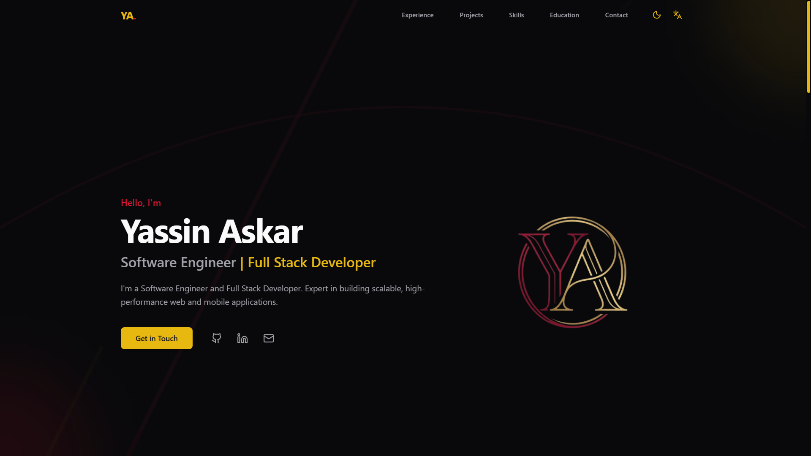
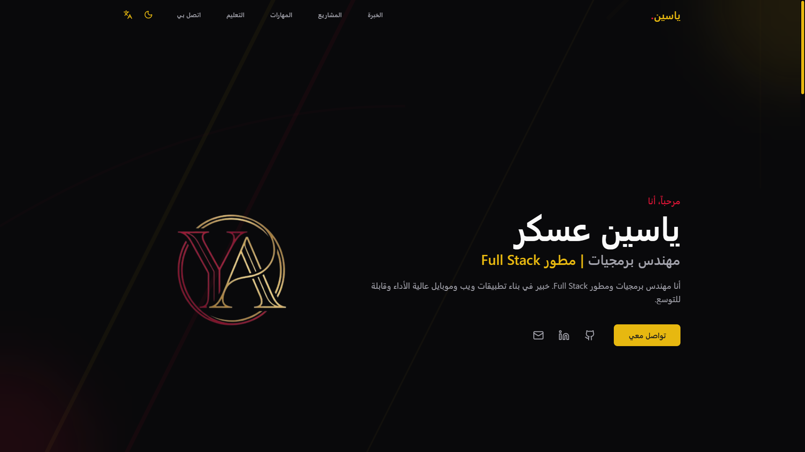
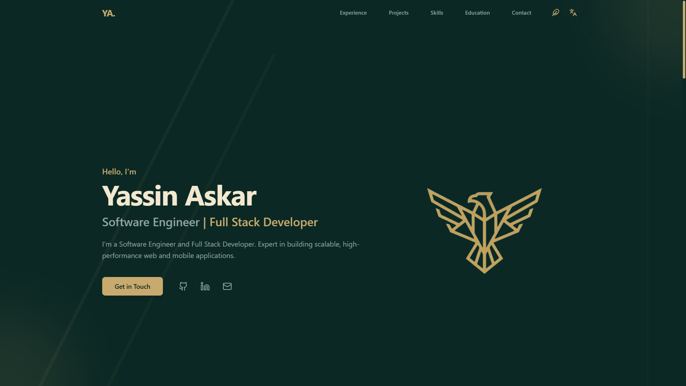

# Portfolio Template

## 👋 A Warm Welcome

Welcome! This is a modern portfolio template that I'm using, and you can easily use it too. It's designed for you to effortlessly modify the data and customize the theme to match your style.

## 📸 Visual Tour

Here is a glimpse into the design and structure of the project:

<div style="display: flex; gap: 10px; flex-wrap: wrap;">
  
  
  
</div>

<br />

## ✨ Key Features

- **⚡ Blazing Fast Performance**: Built on Vite for near-instant HMR (Hot Module Replacement) and optimized production builds.
- **🎨 Modern Aesthetics**: A fully themable UI with support for Glassmorphism and multiple color palettes (Default, Eagle, Apple Glass).
- **📱 Mobile-First Design**: Responsive layouts that offer a native-app-like feel on smaller screens.
- **🌍 Global Ready**: Comprehensive I18n support for **English**, **German**, and **Arabic** (including full RTL layout support).
- **🔧 Zero-Code Content**: Content is separated from logic; update your portfolio by simply editing JSON files in the `data/` folder.

---

## 🚀 Getting Started

Want to run this locally? Follow these steps:

### 1. Clone the repository
```bash
git clone https://github.com/yourusername/portfolio-template.git
cd portfolio-template
```

### 2. Install dependencies
```bash
npm install
```

### 3. Run the development server
```bash
npm run dev
```

The site will be available at `http://localhost:5173`.

## 🛠️ Customization Guide

This template is configured entirely through JSON files, ensuring you never have to touch the complex code.

<pre>
data/
├── <b>config.json</b>       # Toggle features & languages
├── <b>theme.json</b>        # Colors & logo paths
├── <b>icons.json</b>        # Icon mappings
└── <b>locales/</b>          # Text content (en, de, ar)
    ├── en.json
    └── ...
</pre>

### 1. 🌍 Managing Languages
Control which languages your portfolio supports in `data/config.json`.

**To Add a New Language:**
1.  Add the language definition to the `languages` array in `data/config.json`:
    ```json
    { "label": "Spanish", "value": "es", "rtl": false }
    ```
2.  Duplicate `data/locales/en.json` and rename it to `es.json` (matching your value).
3.  Translate the content inside the new file.

> [!TIP]
> **To Remove a Language:** Simply delete the language object from `data/config.json`. You can optionally delete the file from `data/locales/` to keep things clean.

### 2. 🎨 Customizing Logos
Brand your portfolio by updating the assets in `data/theme.json`.

1.  Drop your logo file (e.g., `brand.svg`) into the `public/` directory.
2.  In `data/theme.json`, update the `logo` path for your active theme:
    ```json
    "assets": {
      "logo": "/brand.svg",
      ...
    }
    ```

### 3. 🧩 Managing Icons
We map icon names to files to keep usage simple.

1.  Save your SVG icon to `public/icons/` (e.g., `cool-icon.svg`).
2.  Register it in `data/icons.json`:
    ```json
    "CoolIcon": "/icons/cool-icon.svg"
    ```
3.  Use `"CoolIcon"` anywhere icons are supported in your data files.

## 📦 Deployment

This project maps perfectly to modern hosting platforms like Vercel, Netlify, or GitHub Pages.

### Build
```bash
npm run build
```

### Preview
```bash
npm run preview
```
